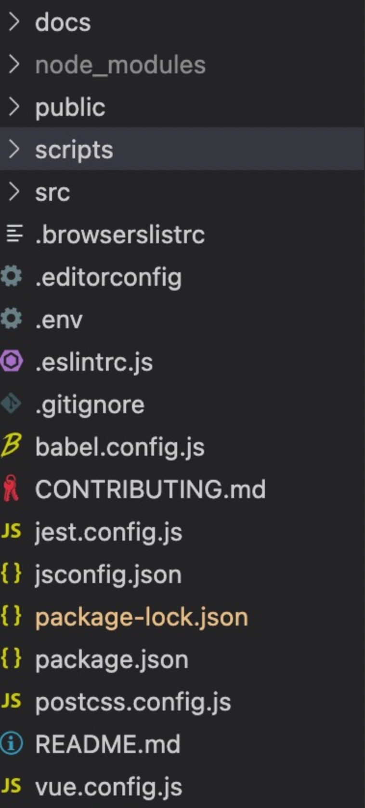
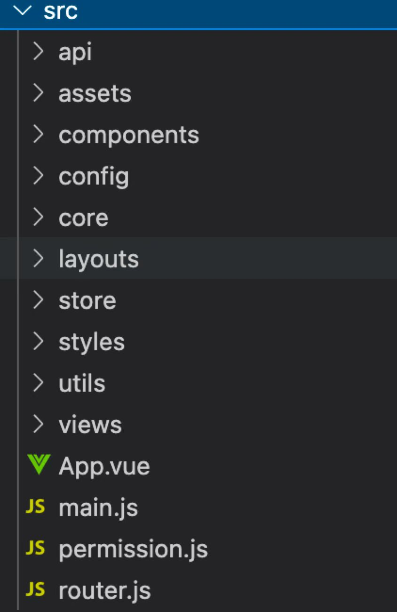

### 1.代码校验规范
前端代码校验规范以下校验规则为准：Eslint+Prettier+Stylelint
#### 1.1 Eslint规范
eslint 以 Eslint官方推荐标准为主，做到统一、规范即可。vue项目 以 vue eslint官方标准为主。
.eslintrc.js 文件配置如下,通过extends引入官方标准的eslint规则：
```Javascript
        module.exports = {
          root: true,
          env: {
            browser: true,
            es6: true,
            node: true
          },
          extends: [
            'eslint:recommended', 
            'plugin:vue/recommended',
            'plugin:vue/essential',
            'plugin:prettier/recommended',
          ],
          parser: 'vue-eslint-parser',
          requireConfigFile: false,
            parserOptions: {
              ecmaVersion: 12,
              sourceType: 'module',
              parser: '@babel/eslint-parser'
            },
          rules: {}
        }
```
#### 1.2 Prettier规范 
Prettier 格式化代码规则对 js 或者 css 等代码进行格式化。
prettier.config.js文件配置Prettier规则如下：
```Javascript
module.exports = {
  // 单行代码的最大宽度
  printWidth: 120,
  // 指定每个缩进级别的空格数
  tabWidth: 2,
  // 使用制表符 (tab) 缩进
  useTabs: false,
  // 在语句末尾打印分号
  semi: true,
  // 多行时尽可能打印尾随逗号
  trailingComma: 'none',
  // 使用单引号而不是双引号
  singleQuote: true,
  // 在对象文字中打印括号之间的空格
  bracketSpacing: true,
  // 将 > 多行 JSX 元素放在最后一行的末尾，而不是单独放在下一行（不适用于自闭元素）。
  jsxBracketSameLine: false,
  // auto | lf | crlf | cr
  endOfLine: 'lf'
}
```
#### 1.3 Stylelint规范  
Stylelint规范校验css代码，以Stylelint官方推荐规则为主。
Stylelint有一百多条校验规则, 这些规则可以分为三类：
* 用于校对风格的规则： 针对空格（比如说冒号附近的空格）、换行、缩进等等。
* 用于判别代码可维护性的规则： 判断在CSS选择器中是否有使用某个ID，或者在某条声明当中是否应用了important关键词。
* 用于判断代码错误的规则： 检测错误的HEX颜色写法或者某条简写属性是否会覆盖其他的声明语句。
stylelint.config.js文件配置Stylelint规则：
```Javascript
module.exports = {
  root: true,
  plugins: ['stylelint-order'],
  extends: ['stylelint-config-standard'],
  rules: {
    'selector-pseudo-class-no-unknown': [
      true,
      {
        ignorePseudoClasses: ['global']
      }
    ],
    'selector-pseudo-element-no-unknown': [
      true,
      {
        ignorePseudoElements: ['v-deep']
      }
    ],
    'at-rule-no-unknown': [
      true,
      {
        ignoreAtRules: ['function', 'if', 'each', 'include', 'mixin']
      }
    ],
    'no-empty-source': null,
    'named-grid-areas-no-invalid': null,
    'unicode-bom': 'never',
    'no-descending-specificity': null,
    'font-family-no-missing-generic-family-keyword': null,
    'declaration-colon-space-after': 'always-single-line',
    'declaration-colon-space-before': 'never',
    'declaration-block-trailing-semicolon': 'always',
    'rule-empty-line-before': [
      'always',
      {
        ignore: ['after-comment', 'first-nested']
      }
    ],
    'unit-no-unknown': [true, { ignoreUnits: ['rpx'] }],
    'order/order': [
      [
        'dollar-variables',
        'custom-properties',
        'at-rules',
        'declarations',
        {
          type: 'at-rule',
          name: 'supports'
        },
        {
          type: 'at-rule',
          name: 'media'
        },
        'rules'
      ],
      { severity: 'warning' }
    ],
    // Specify the alphabetical order of the attributes in the declaration block
    'order/properties-order': [
      'position',
      'top',
      'right',
      'bottom',
      'left',
      'z-index',
      'display',
      'float',
      'width',
      'height',
      'max-width',
      'max-height',
      'min-width',
      'min-height',
      'padding',
      'padding-top',
      'padding-right',
      'padding-bottom',
      'padding-left',
      'margin',
      'margin-top',
      'margin-right',
      'margin-bottom',
      'margin-left',
      'margin-collapse',
      'margin-top-collapse',
      'margin-right-collapse',
      'margin-bottom-collapse',
      'margin-left-collapse',
      'overflow',
      'overflow-x',
      'overflow-y',
      'clip',
      'clear',
      'font',
      'font-family',
      'font-size',
      'font-smoothing',
      'osx-font-smoothing',
      'font-style',
      'font-weight',
      'hyphens',
      'src',
      'line-height',
      'letter-spacing',
      'word-spacing',
      'color',
      'text-align',
      'text-decoration',
      'text-indent',
      'text-overflow',
      'text-rendering',
      'text-size-adjust',
      'text-shadow',
      'text-transform',
      'word-break',
      'word-wrap',
      'white-space',
      'vertical-align',
      'list-style',
      'list-style-type',
      'list-style-position',
      'list-style-image',
      'pointer-events',
      'cursor',
      'background',
      'background-attachment',
      'background-color',
      'background-image',
      'background-position',
      'background-repeat',
      'background-size',
      'border',
      'border-collapse',
      'border-top',
      'border-right',
      'border-bottom',
      'border-left',
      'border-color',
      'border-image',
      'border-top-color',
      'border-right-color',
      'border-bottom-color',
      'border-left-color',
      'border-spacing',
      'border-style',
      'border-top-style',
      'border-right-style',
      'border-bottom-style',
      'border-left-style',
      'border-width',
      'border-top-width',
      'border-right-width',
      'border-bottom-width',
      'border-left-width',
      'border-radius',
      'border-top-right-radius',
      'border-bottom-right-radius',
      'border-bottom-left-radius',
      'border-top-left-radius',
      'border-radius-topright',
      'border-radius-bottomright',
      'border-radius-bottomleft',
      'border-radius-topleft',
      'content',
      'quotes',
      'outline',
      'outline-offset',
      'opacity',
      'filter',
      'visibility',
      'size',
      'zoom',
      'transform',
      'box-align',
      'box-flex',
      'box-orient',
      'box-pack',
      'box-shadow',
      'box-sizing',
      'table-layout',
      'animation',
      'animation-delay',
      'animation-duration',
      'animation-iteration-count',
      'animation-name',
      'animation-play-state',
      'animation-timing-function',
      'animation-fill-mode',
      'transition',
      'transition-delay',
      'transition-duration',
      'transition-property',
      'transition-timing-function',
      'background-clip',
      'backface-visibility',
      'resize',
      'appearance',
      'user-select',
      'interpolation-mode',
      'direction',
      'marks',
      'page',
      'set-link-source',
      'unicode-bidi',
      'speak'
    ]
  },
  ignoreFiles: ['**/*.js', '**/*.jsx', '**/*.tsx', '**/*.ts']
}
```
### 2.Git Commit规范
项目开发时commit内容需要统一规范化，前端commit时规则如下：
```
● type: commit 的类型 （必填）
  ○ feat: 新功能、新特性
  ○ fix: 修改 bug
  ○ perf: 更改代码，以提高性能
  ○ refactor: 代码重构（重构，在不影响代码内部行为、功能下的代码修改）
  ○ docs: 文档修改
  ○ style: 代码格式修改, 注意不是 css 修改（例如分号修改）
  ○ test: 测试用例新增、修改
  ○ build: 影响项目构建或依赖项修改
  ○ revert: 恢复上一次提交
  ○ ci: 持续集成相关文件修改
  ○ chore: 其他修改（不在上述类型中的修改）
  ○ release: 发布新版本
  ○ workflow: 工作流相关文件修改
● scope: commit 影响的范围, 比如: route, component, utils, build…
● subject: commit 的概述
● body: commit 具体修改内容, 可以分为多行.（必填）
● footer: 一些备注, 通常是 BREAKING CHANGE 或修复的 bug 的链接.
```
Commitlint就是对开发提交功能时按照commit规则对commit内容校验。commitlint.config.js配置Commitlint规则如下：
```Javascript
module.exports = {
  ignores: [(commit) => commit.includes('init')],
  extends: ['@commitlint/config-conventional', 'cz'],
  rules: {
    'body-leading-blank': [2, 'always'],
    'footer-leading-blank': [1, 'always'],
    'header-max-length': [2, 'always', 108],
    'subject-empty': [2, 'never'],
    'type-empty': [ 2, 'never' ],
    'subject-case': [0],
    'type-enum': [
      2,
      'always',
      [
        'feat',
        'fix',
        'perf',
        'style',
        'docs',
        'test',
        'refactor',
        'build',
        'ci',
        'chore',
        'revert',
        'wip',
        'workflow',
        'types',
        'release'        
      ]
    ]
  }
}
```
### 3.工程结构规范
项目工程结构需要按照特定的统一规范构建，提高开发效率，方便后期维护。
#### 3.1 脚手架工程化规范
目前公司对现有业务线项目进行归类定制成套脚手架，如当前业务立项属于这几类的需用对应脚手架构建工程，现有脚手架如下：
- vue2框架业务项目脚手架
- vue3框架业务项目脚手架
- vant框架业务项目脚手架
- electron应用业务项目脚手架
- micro-app应用业务项目脚手架
#### 3.2 定制工程化规范
定制化工程可用vue-cli脚手架做初始化，**工程结构规定如下：**
- docs: 存放各种 md 文档
- public: 存放公共资源的 public 资源
- scripts: 工具脚本
- src: 存放源代码资源
- node_modules: 自动安装依赖的目录文件

**src文件夹的目录结构：**
- api: 接口
- assets: 静态资源
- components: 公共组件
- config: 公共配置：比如路由配置，菜单配置
- core: 核心依赖配置
- layouts: 布局文件
- store: vuex 状态管理
- styles: 样式
- utils：工具函数
- views：页面
- main.js: 入口文件
- permission.js: 权限文件
- router.js: 路由入口文件
