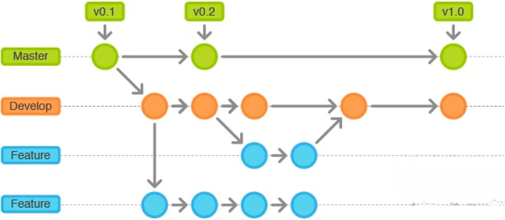
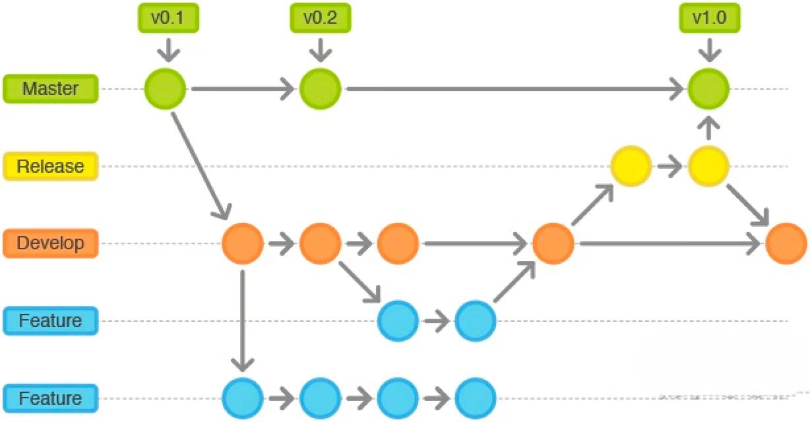
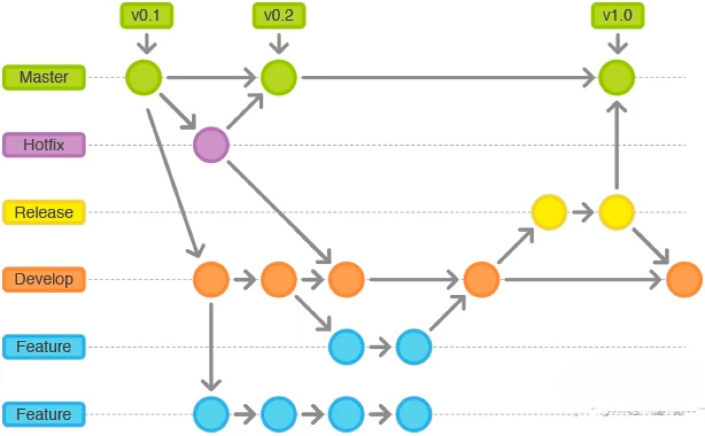

### 1.Git Branch 规范
- **Master分支:** 永久分支，分支上的Commit都有对应的Tag，分支与线上版本保持一致。
- **Develop分支:** 永久分支，从公Master拉取Develop分支，不直接合并到Master分支，其通过Release分支合并到Master分支。
- **Feature分支:**
  - 临时分支，需要开发新的特性时，从Develop分支拉取Feature分支。
  - Feature分支命名规范以feat/功能名称。
  - 开发中存在，开发测试完后合并到develop后或是丢弃后，便删除。
- **Release分支:**
  - 临时分支，基于Develop分支创建。
  - 创建Release分支之后不要从Develop分支上合并新的改动到Release分支。
  - 发布Release分支时，合并Release到Master和Develop， 同时在Master分支上打个Tag记住Release版本号，删除Release分支。
  - Release分支命名规范以release/版本号。
- **hotfix分支:**
  - 临时分支，基于Master分支创建，开发完后需要合并回Master和Develop分支，同时在Master上打一个tag，删除hotfix分支。
  - hotfix分支命名规范以hotfix/bug名称。

### 2.Git Flow 规范
  - **开发功能时:**
    

  - **发布功能时:**
    
  - **修复线上功能时:**  
    
### 3.Git Group 规范
  - **Git Group使用规范:**
  Group 分为 rule(技术行为规范)、lab（技术预研）、common(基础库)、realicloud(基础平台)、rexxox(产品)、customer(定制化开发项目)。gitlab主要包括三种权限Private、Internal、Public，分别为只对组内用户开放、注册用户可见和公开，公司gitlab一般不使用Public。
    - rule - Internal：主要用于存放技术预研，比如shader预研、售前demo技术预研等。
    - common - Internal：主要用于存放公共组件库，基础算法库。
    - rexxxud - Private：主要用于存放底层基础能力平台相关微服务，如PaaS层的接口、网关鉴权服务等。
    - rexxxb - Private：主要存放产品相关业务代码，如应用中心小程序等。
    - customer - Private：主要存放客户制定化开发项目代码。
  - **Git Group 角色权限规范:**
    - Guest:可以创建issue、发表评论、不能读写版本库。
    - Reporter:可以克隆代码，不能提交，QA、PM可以赋予这个权限。
    - Developer:可以克隆代码、开发、提交、push、RD可以赋予这个权限。
    - Master:可以创建项目、添加 tag 、保护分支、添加项目成员、编辑项目、核心RD负责人可以赋予这个权限。
    - Owner:可以设置项目的访问权限-Visibility Level、删除项目、迁移项目、管理组成员、开发组leader可以赋予这个权限。
  - **Git Group 角色分配规范:**
    - 业务线项目：业务线管理者或者部门组长赋有Owner角色，业务线主要负责开发人员赋有Master角色，业务线临时参与开发人员赋有Developer角色。
    - 基础基建项目：前端基础研发组赋有Owner角色，前端技术委员成员赋有Maser角色，临时参与开发人员赋有Developer角色。
  - **Git Group 命名规范**
    - group命名规范：业务线英文名称命名。
    - group下项目命名规范：[业务线英文名称]-[项目英文名称] 
  - **Git Group 项目仓库创建规范**  
    - 项目创建需符合Group规范。
    - 创建项目必须添加Project description说明。
    - 每个项目都需要README.md文件。
    - 除文档说明类型仓库，所有代码仓库都需要.gitignore。
  - **Git Group 项目仓库README.md文件规范**
    - Introduction 用于阐述项目基本情况和功能（是什么，用来做什么的）。
    - Quick Start 主要包括两部分内容：简易的安装部署说明(Deployment)和使用案例(Example)。
    - Documentation 部分是核心的文档，对于大型项目可以使用超链接代替。
    ```
    <项目简介/Introduction>
    <快速使用/Quick start>
    <文档说明/Documentation>  
    ```