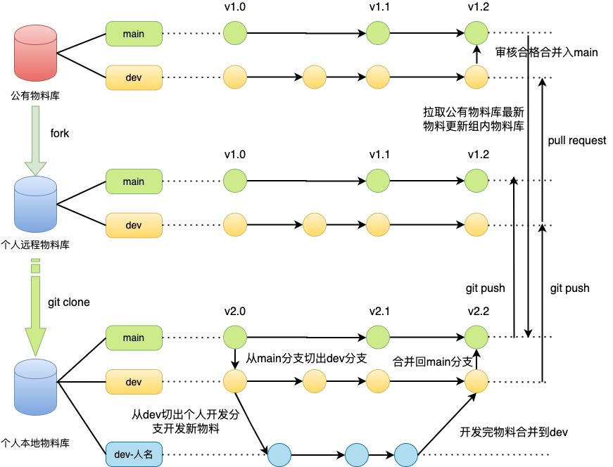

### 1.物料库工程规范
- 物料库以一个项目仓库中管理多个模块/包（Monolithic Repository）形式建设，即项目中有一个packages 文件夹，文件夹中所有文件都是一个包，每个包就是一个物料组件。
- 物料库工程建设主要技术栈：Yarn+Npm+Lerna+Webpack+Vuepress+Hygen。
#### 1.1 物料库工程结构规范
- templates目录：物料组件模版工程。
- docs目录：物料库文档工程。
- pakages目录：物料开发工程。
- scripts目录：物料库工程化全局执行脚本。
```
.
├── _templates
│   ├── generator
│   │   ├── help
│   │   │   └── index.ejs.t
│   │   ├── new
│   │   │   └── hello.ejs.t
│   │   └── with-prompt
│   │       ├── hello.ejs.t
│   │       └── prompt.ejs.t
│   ├── init
│   │   └── repo
│   │       └── new-repo.ejs.t
│   └── pkg-tp
│       └── with-prompt
│           ├── README.ejs.t
│           ├── index.ejs.t
│           ├── package.ejs.t
│           ├── prompt.js
│           ├── template.ejs.t
│           └── test.ejs.t
├── commitlint.config.js
├── docs
│   ├── README.md
│   ├── materiel
│   │   ├── README.md
│   │   ├── block
│   │   │   └── NavMenu.md
│   │   ├── components
│   │   │   ├── Select.md
│   │   │   └── Slider.md
│   │   └── page
│   │       └── Layout.md
│   └── standard
├── jest.config.js
├── lerna-debug.log
├── lerna.json
├── package-lock.json
├── package.json
├── packages
│   └── Button
│       ├── README.md
│       ├── __tests__
│       │   └── Button.test.js
│       ├── dist
│       │   └── @Hi
│       │       └── Button.min.js
│       ├── package.json
│       └── src
│           ├── Button.vue
│           └── index.js
├── prettier.config.js
├── scripts
│   ├── build.js
│   └── test.js
├── stylelint.config.js
├── tree
├── tree-1
├── tsconfig.json
├── webpack.config.js
├── yarn-error.log
└── yarn.lock


```
#### 1.2 物料库版本管理规范
物料库每次发布，package.json中version都要改变，规则使用npm官方推行的semver： 版本格式：主版号.次版号.修订号，版号递增规则如下：
- 主版号：大改动，不向下兼容，更新主版号。
- 次版号：新增或改动了功能，向下兼容，更新次版号。
- 修订号：修复了bug，向下兼容，更新修订号。
#### 1.3 物料库发布规范
- 需要先在package.json中的name字段加上组织名"@hi-[业务线缩写小写]/"，version按照版本管理规范修改。
- 注册用户：npm adduser。
- 登入用户：npm login。
- 物料库工程根目录执行：npm publish。
- npm包发布完成后，对main分支打tag。

注：业务线缩写小写以业务线全称前三字小写全拼。
### 2.物料组件规范
物料组件规范从物料组件工程目录，命名格式和设计思路几个纬度规范。
#### 2.1 物料组件工程结构规范
- README.md：物料组件用户说明。
- dist：物料组件打包目录。
- src目录：物料组件功能实现目录。
- __tests__目录：物料组件功能测试目录。
- package.json：物料组件依赖管理。
```
├── packages
│   └── Button
│       ├── README.md
│       ├── __tests__
│       │   └── Button.test.js
│       ├── dist
│       │   └── @Hi-caiwu
│       │       └── Button.min.js
│       ├── package.json
│       └── src
│           ├── Button.vue
│           └── index.js
```
#### 2.2 物料组件命名规范
命名规范：
- 物料组件工程文件夹命名：[业务线缩写]_[功能全称]。
  - 业务线缩写：业务线名称首字母大写缩写，占位三位以内。
  - 功能全称：以大驼峰命名，即首字母大写的驼峰命名，且在三个单词以内拼接。

  例如：CW_Button.
- 物料组件工程文件命名：组件文件命名和工程文件夹命名同名。
- 物料组件包命名：是写在组件工程package.json里面 @hi-[业务线缩写小写]/ 后面，以功能全称小写拼接，原本的大驼峰写法变成以‘-’连接。
  
  例如：@hi-caiwu/my-button
#### 2.3 物料组件设计规范
- 复用性是物料组件封装的首要前提，有一定复用率的业务功能才考虑封装成物料组件。
- 对外扩展属性props，设计尽量详尽，外部通过传入props属性对应值来控制和输出物料组件，展示物料组件功能。
- 预留slot插槽，一个物料组件，往往不能完美的适应所有的应用场景，所以在封装组件的时候，只需要完成组件的80%的功能，剩下的20%让父组件通过slot解决。
- 异步数据交互类事件并不是对接组件内部特定接口的，通过事件触发的形式（$emit，$on）暴露给外部场景去做事件处理。
- 物料组件内部样式使用scoped样式作用域来做样式隔离。
- 物料组件内部还有子组件，数据通信可以通过Bus事件总线的形式管理。
### 3.物料库git规范
#### 3.1 git分支维护规范
- main主分支：受保护分支，控制发布版本号管理。
- dev开发分支：与main并行分支，保有当前即将发布或是已经发布的代码。
- dev-[开发人名全拼拼音]: 物料开发人员个人开发分支。
#### 3.2 git分支tag规范
- 使用场景：在物料合并main分支发布之后一定要给main分支添加tag，方便后续有新物料时快速回滚到指定的稳定版本。
- tag命名规范：版本类型_版本号，比如：stable_v1.1.0，意为：稳定版v1.1.0。
- 版本类型说明：
  - pre：预发布版，用于运维同学知晓要构建的代码。
  - stable：稳定版，新功能上线后使用这个类型。
  - hotfix：修复版，修复线上bug使用这个类型。
- 版本号设置说明：
  - 第一个数字1，代表大版本，默认从1开始，大版本更新时才递增。
  - 第二个数字0，代表小版本更新，默认从0开始。
  - 第三个数字0，代表补丁版本，默认从0开始。
#### 3.3 forking workflow工作流规范
  